<!--
  Profile README for github.com/crispinedev/crispinedev
  - assets/header.svg, assets/stats.svg and assets/footer.svg are self-hosted animated SVGs (no third-party service to go down).
  - The snake and the languages card are built by .github/workflows/profile-assets.yml and published daily to the `output` branch.
  - Stats, experience, impact numbers and certifications mirror crispine.co.ke. Update both together.
  - Only link pages that actually load, and only public repos. Uncomment the hidden sections when the thing they reference is live.
-->

<p align="center">
  
</p>

<p align="center">
  
</p>

<p align="center">
  <a href="https://crispine.co.ke"></a>
  <a href="https://www.linkedin.com/in/crispine-kuria"></a>
  <a href="https://x.com/crispine081"></a>
  <a href="https://wa.me/254705261887"></a>
  <a href="mailto:hello@crispine.co.ke"></a>
  
</p>

<p align="center">
  
</p>

<p align="center">
  <i>“Code that scales. Design that resonates. Systems that endure.”</i><br/>
  <sub>Full-Stack Development ✦ Brand Identity ✦ UI/UX Design ✦ E-Commerce Engineering ✦ Automation Systems ✦ Digital Marketing</sub>
</p>

---

## 👋 About me

<table>
<tr>
<td width="55%" valign="top">

- 🇰🇪 Full-stack developer & designer based in **Nairobi, Kenya**
- 🛒 I build **production commerce infrastructure** for African markets — payments, multi-tenant SaaS, and the self-hosted systems that run them
- 💼 **IT Programmer Analyst at Dynamic Kenya LTD** by day; I run **[Pixalate](https://pixalate.co.ke)** (design & engineering studio) and **Safi Systems** (managed hosting & Odoo)
- 💸 **M-Pesa**, **WhatsApp** and low-bandwidth users are my starting assumptions, not afterthoughts
- 🎓 **BSc Applied Computer Science**, Egerton University · CCNA · AWS Cloud Practitioner
- 🤖 Currently deep into **AI tooling** — Claude API and agent workflows
- 💬 Ask me about **M-Pesa Daraja, Odoo, Docker/Nginx deployments, networking, brand design**
- 📫 Fastest reply: **[hello@crispine.co.ke](mailto:hello@crispine.co.ke)** or **[WhatsApp](https://wa.me/254705261887)**

</td>
<td width="45%" valign="top">

```ts
const crispine = {
  based:     "Nairobi, Kenya 🇰🇪",
  timezone:  "EAT (UTC+3)",
  roles:     ["full-stack developer", "graphic designer"],
  dayJob:    "IT Programmer Analyst @ Dynamic Kenya",
  running:   ["Pixalate", "Safi Systems"],
  building:  ["SokoFlow", "Storewave", "Stitch"],
  payments:  "M-Pesa Daraja 💸",
  hosting:   "self-hosted, always 🐳",
  speaks:    ["English", "Kiswahili"],
  openTo:    "contract work via Pixalate",
};
```

</td>
</tr>
</table>

## 📈 Impact

- ⚡ **36%** improvement in development speed and system performance at Dynamic Kenya LTD
- 📉 **25%** fewer support inquiries at Dynamic Kenya LTD
- 🛒 **40%** faster order processing on a full-stack e-commerce platform with payments and a live inventory dashboard
- 🤖 **50%** faster average customer response time with an AI support chatbot
- 📣 **30%** more social media engagement within 60 days of a corporate branding campaign launch

## 🚀 What I'm building

| Status | Project | What it is |
|:--|:--|:--|
| 🟢 Live | **Safi Systems** | Managed hosting & Odoo for Kenyan SMEs — Docker, Nginx, Postgres, backups, monitoring, done for you |
| 🟢 Live | **[Pixalate](https://pixalate.co.ke)** | Design & engineering studio — brand, web, and automation work |
| 🧪 Beta | **SokoFlow** | Multi-channel commerce for Kenyan sellers — WhatsApp, Instagram, and web storefronts with M-Pesa built in |
| 🔨 Building | **Moment** | QR guestbook & live photo wall for weddings, graduations and birthdays — guests post with no app or sign-up, hosts unlock a ZIP of every memory via M-Pesa |
| 🔨 Building | **Stitch** | Personalized keepsakes for the people who raised you — scrapbooks and letters, sibling invites, voice notes, WhatsApp delivery, M-Pesa unlock |
| 🔨 Building | **Storewave** | Multi-tenant e-commerce SaaS — one platform, many stores |
| 🔨 Building | **Swiss Scraper → Sentinel** | POS-loss detection engine, being generalized into an open-source monitoring tool |

<!-- Add rows as products launch: Yessify, Soundboard. Link a project only once its repo or site is public. -->

## 📂 On GitHub

| Repo | What it is | Built with |
|:--|:--|:--|
| 🖼️ **[My-Portfolio](https://github.com/crispinedev/My-Portfolio)** | The source of [crispine.co.ke](https://crispine.co.ke) — static Next.js portfolio with case studies, service pages and a client brief form | Next.js · Tailwind · Framer Motion |
| 🩺 **[Kiki's Medical](https://github.com/crispinedev/E-commerce-Kiki-s-Medical)** | WooCommerce store for a medical supplies business, built on a customized ProPharm child theme | WordPress · WooCommerce |

<!--
  Open source — uncomment each row on the day the repo goes public. Never before.

| Project | What it does |
|:--|:--|
| 💸 **[daraja-kit](https://github.com/crispinedev/daraja-kit)** | Type-safe M-Pesa Daraja toolkit for Node/Next.js — STK Push, C2B/B2C, webhook validation, local sandbox mock |
| 🛰️ **[sentinel](https://github.com/crispinedev/sentinel)** | Declarative web monitoring: scrape → diff → detect anomalies → alert via WhatsApp/Telegram |
| 🚀 **[stackpilot](https://github.com/crispinedev/stackpilot)** | One command from fresh Ubuntu VPS to hardened production — Docker, Nginx + TLS, Postgres backups, monitoring |
-->

## 🧰 Tech stack

<table>
  <tr>
    <td>💻 <b>Frontend</b></td>
    <td></td>
  </tr>
  <tr>
    <td>⚙️ <b>Backend & data</b></td>
    <td></td>
  </tr>
  <tr>
    <td>☁️ <b>Cloud & DevOps</b></td>
    <td></td>
  </tr>
  <tr>
    <td>🎨 <b>Design & CMS</b></td>
    <td></td>
  </tr>
  <tr>
    <td>🤖 <b>Automation, AI & integrations</b></td>
    <td>
      
      
      
      
      
      
      
      
    </td>
  </tr>
  <tr>
    <td>🛡️ <b>Networking & security</b></td>
    <td>
      
      
      
    </td>
  </tr>
</table>

> 🏠 Everything I ship is self-hosted on infrastructure I manage — the same stack I run for Safi Systems clients. If I recommend it, I'm running it in production.

## 💼 Experience

| When | Role | Where |
|:--|:--|:--|
| 2024 – now | 🧑‍💻 **IT Programmer Analyst** | Dynamic Kenya LTD, Nairobi |
| 2023 | 🌐 **Remote IT Manager** | Amaris Solutions Group |
| 2022 | 💻 **Freelance Web & Software Developer** | Upwork |
| 2021 | 🛠️ **Freelance Software Developer & IT Consultant** | Self-employed |
| 2021 | 🖥️ **Remote System Administrator** | Equident Healthcare |

## 🎓 Education & certifications

<p>
  
</p>
<p>
  
  
  
  
</p>

## 📊 GitHub activity

<p align="center">
  
  
</p>

<p align="center">
  <picture>
    <source media="(prefers-color-scheme: dark)" srcset="https://raw.githubusercontent.com/crispinedev/crispinedev/output/snake-dark.svg" />
    <source media="(prefers-color-scheme: light)" srcset="https://raw.githubusercontent.com/crispinedev/crispinedev/output/snake-light.svg" />
    
  </picture>
</p>

<!--
## ✍️ Recent writing
  Enable this section + the update-readme workflow once crispine.co.ke/rss.xml is live.
<!== BLOG:START ==>
<!== BLOG:END ==>
-->

## 🤝 Let's work together

Open to **contract work through [Pixalate](https://pixalate.co.ke)** — web apps, M-Pesa integrations, Odoo deployments, e-commerce, automation, and brand design.
**[crispine.co.ke](https://crispine.co.ke)** · Chat on **[WhatsApp](https://wa.me/254705261887)** · Fastest reply: **[email](mailto:hello@crispine.co.ke)** ✉️


<p align="center"><sub>⏱️ Nairobi (EAT, UTC+3) · 🐍 Snake and languages refreshed daily by GitHub Actions · Thanks for stopping by ✨</sub></p>
